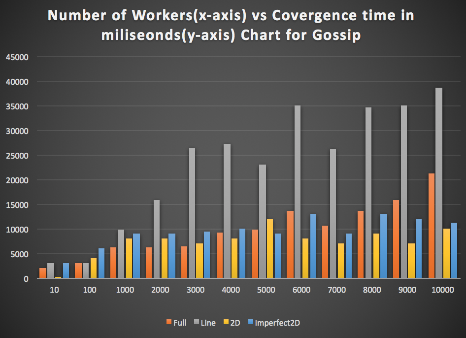
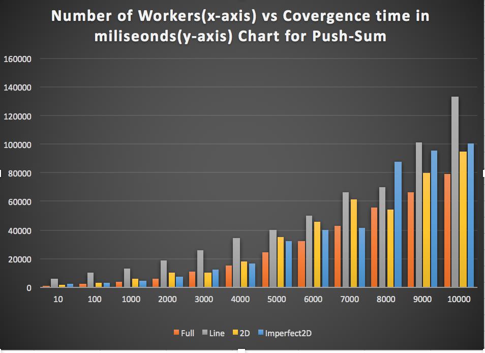

# Project2 : GOSSIP SIMULATOR

**Group members**

| Name                 | UFID     | Email ID                 |
| :------------------: | :------: | :----------------------: |
| Govind Rajan Chandra | 26113109 | cgovindrajan@ufl.edu     |
| Chaitanya Kulkarni   | 19160119 | chaitanyaakulkar@ufl.edu |

# Project Defination

- Goal of the project is to implement gossip protocol using simple gossip and push sum algorithm using various topology.
- Topologies implement are : 
  1. Full Topology
  2. Line Topology
  3. 2D Topology
  4. Imperferct Topolgy

- Algorithm implemented are :
  1. Gossip Simulator
  2. Push-Sum Algorithm

# Execution Steps

> Compile

```
mix clean
mix escript.build
```
 
> Initialize and start gossip

``` 
./project2 <Number Of Nodes> <Topology Type> <Algorithm>
```
The code requires two arguments: 
* arg1 : Number Of Nodes - Number of nodes to be simulated.
* arg2 : Topology Type - Any one of "full" OR "line" OR "2d" OR "imp2d"
* arg3 : Algorithm - Any one of "gossip" OR "push-sum"

- Note : For 2D and imp2D number of nodes will be rounded to nearest perfect square.

# Implementation Details

### Gossip Algorithm for information propagation ###

The Gossip algorithm involves the following:
* **Starting**: A participant(actor) it told/sent a roumor(fact) by the main process
* **Step**: Each actor selects a random neighboor and tells it the roumor 
* **Termination**: Each actor keeps track of rumors and how many times it has heard the rumor. It stops transmitting once it has heard the roumor 10 times (10 is arbitrary, any value can be configured).

### Push-Sum algorithm for sum computation ###

* **State**: Each actor maintains two quantities: s and w. Initially, s = i (that is actor number i has value i) and w = 1
* **Starting**: Ask one of the actors to start from the main process.
* **Receive**: Messages sent and received are pairs of the form (s, w). Upon receive, an actor adds received pair to its own corresponding values. Upon receive, each actor selects a random neighboor and sends it a message.
* **Send**: When sending a message to another actor, half of s and w is kept by the sending actor and half is placed in the message.
* **Sum estimate**: At any given moment of time, the sum estimate is s/w where s and w are the current values of an actor.
* **Termination**: If an actors ratio s/w did not change more than 10^−10 in 3 consecutive rounds the actor terminates. 
_WARNING: the values s and w independently never converge, only the ratio does._

## Topologies ##

The actual network topology plays a critical role in the dissemination speed of Gossip protocols. This project has simulators for various topologies. The topology determines who is considered a neighboor in the above algorithms.

* **Full Network**:  Every actor is a neighboor of all other actors. That is, every actor can talk directly to any other actor.
* **2D Grid**: Actors form a 2D grid. The actors can only talk to the grid neigboors.
* **Line**: Actors are arranged in a line. Each actor has only 2 neighboors (one left and one right, unless you are the first or last actor).
* **Imperfect 2D Grid**: Grid arrangement but one random other neighboor is selected from the list of all actors (4+1 neighboors).


# Key Observations #

Observation made was over average of 3 runs of each permutations.
1. Both algorithm fails to achieve the termination condition depending upon the termination of it's neighbour in the topology. i.e. For example Consider line topology having setup like PID-1 <-> PID-2 <-> PID-3 and PID-1 and PID-3 reach termination condition then PID-2 will become dangled process hence the entire process will never reach termination.
2. If we increase the number of rumors sent by any process in each step then their is relative decrease in convergence time(~15% on average with 3 rumors in each step).
3. Maximum number of workers with correct stimulation :


| Algorithm | Topology | Num of Worker |
| :-------: | :------: | :-----------: |
| gossip    | full     | 40000          |
| gossip    | line     | 20000          |
| gossip    | 2D       | 30000          |
| gossip    | imp2D    | 30000          |
| push-sum  | full     | 35000          |
| push-sum  | line     | 18000          |
| push-sum  | 2D       | 25000          |
| push-sum  | imp2D    | 30000          |


# Performance 

Here are some Graphs describing the performance achieved with our code.




